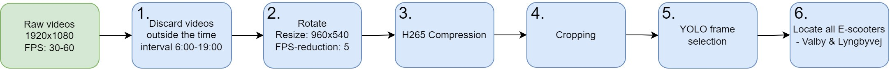
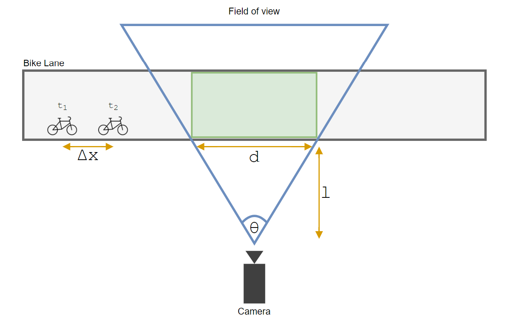
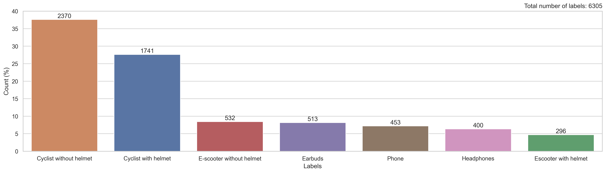
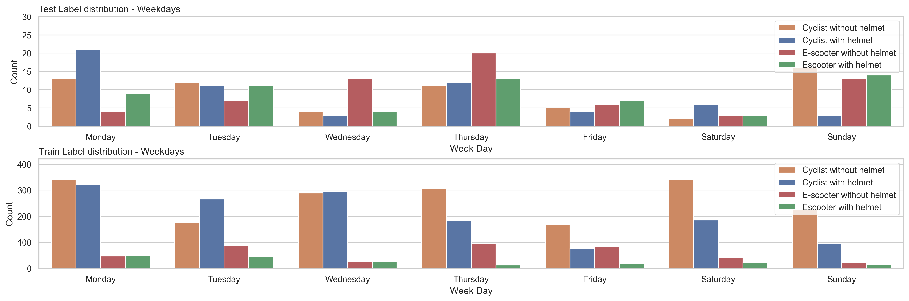

## 1. TL;DR

**Bachelor’s Thesis**  
**Title:** Detection of Safety-Related Objects on Bicycles and e-Scooters Using YOLO

### Summary
- Collected bike lane footage in Copenhagen (2021–2022)
- Built a labeled dataset: bike and e‑scooter riders with helmets, phones, headphones, and earbuds
- Trained custom YOLO models with task-specific augmentations

### Results:
- 2-class model (cyclist/e-scooter): **mAP@0.5 = 0.96**
- 4-class model (cyclist/e-scooter with helmet/no helmet): **mAP@0.5 = 0.73**
- Found e-scooter helmet use rose ~5% → ~55% after 2022 helmet law

  
*Outputs from our final model: En (e-scooter no helmet), Eh (e-scooter helmet), Cn (cyclist no helmet), Ch (cyclist helmet)*

---

## Overview

Our work can be divided into 5 major components:

1. **Urban Safety Dataset**: Physically manufactured camera boxes, video collection, data pre-processing, labeling.
2. **Augmentation**: Designed a suitable augmentation pipeline including custom augmentations such as rain and scratches.
3. **Object Detection Using YOLO**: Custom YOLO model design.
4. **Model training, evaluation, and deployment**: Experimental setup, mAP, and carefully designed train-test splits.
5. **Results**: Quantitative results and key insights, including policy-relevant findings.

---

## 1.) Urban Safety Dataset
The image below gives a quick overview of how the Urban Safety Dataset (USD) was built, from raw video and external sources, through preprocessing, and all the way to the final annotations. It also shows the recording locations and the safety-related object classes included.
In the next few sections, I’ll walk through each part of the process in a bit more detail.

### 1.1 Data Collection – Setup, Locations and Recordings

We collected video from three Copenhagen sites: **Egmont**, **Lyngbyvej**, and **Valby**.

- **Egmont** was dropped due to poor lighting and motion blur.
- **Lyngbyvej** and **Valby** provided usable footage with steady traffic.

Recordings were done using custom camera boxes: a compact camera, power bank, and sealed front — all strapped to poles for a clear view of the bike lanes.

Recordings were carried out over two periods: late 2021 and early 2022. Each session lasted a full week per location.
To avoid issues with motion blur in low light, we discarded footage outside the interval **06:00–19:00**. While night footage might have been interesting (e.g. light usage), the video quality just wasn’t usable.

### 1.2 Preprocessing

Our raw video data totaled ~4 TB, most of it redundant. We built a 6-step pipeline to reduce size while keeping the important bits.

#### Overview

#### Step-by-Step Example

#### 1.2.1 Time Restriction
We only used footage between **06:00 and 19:00** to avoid motion blur from poor lighting at night. This alone cut down the total volume significantly.

#### 1.2.2 Rotation, Resizing & FPS Reduction

- Rotated videos to correct orientation (multiples of 90° only).
- Resized from 1920×1080 → 960×540.
- Dropped FPS to 5 to reduce size without missing fast-moving objects.

To justify the FPS drop, we modeled a worst-case scenario where a fast-moving object (up to 50 km/h) appears as close as 1.5 m to the camera with a 90° field of view:

The smallest FPS $N$ that ensures no object is missed can be expressed as:

$$
\max_{N \in \mathbb{N}} \left(v_{\text{max}} \cdot \frac{1}{N}\right)
\quad \text{s.t.} \quad
v_{\text{max}} \cdot \frac{1}{N} < d
$$

where $d$ is derived using basic trigonometry:

$$
\tan\left(\frac{\theta}{2}\right) = \frac{d/2}{l}
\quad \Longleftrightarrow \quad
d = \tan\left(\frac{\theta}{2}\right) \cdot 2l
$$

We set $v_{\text{max}} = 50\,\mathrm{km/h}$, $\theta = 90^\circ$, and $l = 1.5\,\mathrm{m}$. Thus:

$$
\max_{N \in \mathbb{N}} \left(50\mathrm{\frac{km}{h}} \cdot \frac{1}{N}\right)
\quad \text{s.t.} \quad
50\mathrm{\frac{km}{h}} \cdot \frac{1}{N} < \tan\left(\frac{90^\circ}{2}\right) \cdot 2 \cdot 1.5\,\mathrm{m}
$$

This yields $N = 5$. Therefore, reducing the frame rate to 5 FPS still ensures each object of interest appears in at least one frame.

#### 1.2.3 Compression
We applied fairly aggressive **H.265 compression** using `ffmpeg` to reduce the file size as much as possible without compromising usability. 

#### 1.2.4 Cropping
Cropped out the sky, poles, and other irrelevant regions to cut down size and focus only on the bike lane.

#### 1.2.5 YOLO Frame Selection
Most frames contained nothing of interest. We used a pretrained **YOLOv3 model (Ultralytics, COCO-trained)** to keep only frames containing bikes or people. Confidence threshold was set very low (20%) to avoid false negatives.
This step was critical to speed up annotation later.

#### 1.2.6 Manual E-Scooter Search
E-scooters were rare. We manually located and labeled every instance in all videos from Valby and Lyngbyvej. Took ~24–48 man-hours but was necessary for class balance and helmet law analysis.

### 1.3 Robustness Dataset

To improve generalization, we created a small **Robustness Dataset** covering conditions not seen in our main dataset—like different clothing, lighting, and viewpoints. It includes:

- **500 summer frames** from a prior project (recorded on Lyngbyvej)
- **429 Creative Commons images** from DuckDuckGo and Google

This helped diversify perspectives (e.g. front, back views) and clothing styles (e.g. shorts vs. winter jackets), which were underrepresented in our original footage.

*Ten random samples from the Robustness Dataset*
 

### 1.4 Final Overview

After preprocessing, the raw ~4 TB of footage was reduced to ~10 GB.  
The final dataset contains **4870 images** and **6305 labeled instances** across 7 classes:

- Cyclist with/without helmet
- E-scooter with/without helmet
- Headphones
- Earbuds
- Phone

  
*Final label distribution across all classes*

---

## 2.) Augmentation

To improve generalization and reduce overfitting, we designed three categories of augmentations tailored to our use case:
1. **Basic Augmentation** – standard image transforms
2. **Special Augmentation** – custom artifacts like rain and dirt
3. **Mosaic Augmentation** – combining multiple images into one

### 2.1 Basic Augmentation

We used nine standard augmentations to artificially increase dataset diversity. Each transformation was carefully tuned to preserve bounding boxes and reflect realistic noise in low-budget outdoor cameras.

### 2.2 Special Augmentation

We developed custom augmentations to simulate camera lens issues specific to outdoor bike lane recordings:

- **Rain and water**: simulates large droplets and streaks
- **Lens wear & tear**: scratches, smudges, fingerprints
- **Dirt and debris**: particles and residue on the lens

These were applied using pre-   generated texture maps randomly overlaid and blended with input images. This helps the model remain robust when visibility is partially obstructed.

  

And here's a breakdown of the general method:

### 2.3 Mosaic Augmentation

We implemented **Mosaic Augmentation**, introduced in YOLOv4, to further improve generalization.

It works by:
1. Selecting 4 random images
2. Applying basic augmentation and resizing each to half-size
3. Stitching them into a larger image
4. Cutting out a center region
5. Recalculating bounding boxes

This exposes the model to multiple objects, backgrounds, and contexts within a single image.

---

## 3.) Object Detection Using YOLO

### 3.1 Introduction

As illustrated in **Figure 1**, YOLO works in four simple steps:

  

1. **Feature extraction**  
   A CNN processes the input image to extract visual features.

2. **Grid division**  
   The image is divided into an S×S grid of equal cells.

3. **Bounding‑box regression**  
   Each cell predicts one or more boxes, encoded as (x, y, w, h).

4. **Objectness & classification**
    - **Confidence score:** probability the box contains an object
    - **Class probabilities:** distribution over all categories

All cells make these predictions in parallel in a single forward pass.

### 3.2 Model Architecture

Our model combines ideas from **YOLOv1** and **YOLOv3**: a DarkNet‑53 backbone for feature extraction plus a direct cell‑regression head (no anchors).  
Input: $$3\times348\times348$$ RGB → Output reshaped to $$12\times12\times9$$ per‑cell predictions.

#### Backbone (DarkNet‑53)

- **53 layers** (alternating)
    - **Conv:** $$3\times3$$ kernels, stride 2 (first layer uses stride 1)
    - **Residual block:** two convs $$1\times1$$ and $$3\times3$$ with skip connection
- After every conv: BatchNorm → LeakyReLU

#### Head

1. **Average Pool** → $$1024\times1\times1$$
2. **Flatten** → $$1024$$
3. **Fully Connected** → $$1296$$ $$(=12\times12\times9)$$
4. **Reshape** → $$(12,12,9)$$

#### Final activations

- Sigmoid, $$\sigma(x)=\frac{1}{1+e^{-x}}$$, is applied to $$P_{\mathrm{obj}},x$$ and $$y$$
- $$|w|,|h|$$ via absolute value to enforce non‑negativity
- Softmax over the 4 class logits → $$c_1,\dots,c_4$$

**Per‑cell output vector**  
$$\[x,y,w,h,P_{\mathrm{obj}},c_1,\dots,c_4\]$$

### 3.3 NMS
Our model predicts $$12^2 = 144$$ boxes (one per cell). To eliminate duplicates, we apply **class‑agnostic non‑max‑suppression (NMS)**:

1. **Format conversion**  
   Convert each box from cell format $$x,y,w,h$$ to absolute cartesian coordinates $$x_{\min},y_{\min},x_{\max},y_{\max}$$.

2. **Score filtering**  
   Discard all boxes with objectness score $$P_{\mathrm{obj}} < T_{\mathrm{conf}}$$.

3. **Iterative suppression**
   - While any boxes remain:  
     a. Pick the box $$B_{\max}$$ with highest confidence.  
     b. Add $$B_{\max}$$ to the final detections.  
     c. Remove every other box $$B$$ whose  
     $$\mathrm{IOU}(B, B_{\max}) = \frac{\text{area of intersection}}{\text{area of union}}$$  
     exceeds the threshold $$T_{\mathrm{iou}}$$.

The full pseudo‑code is shown here:

### 3.4 YOLO Loss

Our loss is a stripped‑down blend of YOLOv1 and YOLOv2: squared error for geometry and objectness, cross‑entropy for class labels:

The loss does five tasks, one for each line:

1. **Centre error** (x,y) 
2. **Size error** (w,h)
3. **Object present** penalise bad confidences where a target exists  
4. **Object absent** penalise false alarms (down‑weighted)  
5. **Class error** cross‑entropy on soft‑maxed logits  

We use $$\lambda_{\text{coord}} = 5.0$$ and $$\lambda_{\text{noobj}} = 0.5$$.

**Why the weights?**
* $$\lambda_{\text{coord}}$$ is large because mis‑placing a box hurts more than a small confidence slip.  
* $$\lambda_{\text{noobj}} < 1$$ prevents the sea of empty cells from drowning the signal.

---

## 4.) Model training, evaluation, and deployment

### 4.1 Train and Test Split

The Urban Safety Dataset was split into training (≈95 %) and test (≈5 %) sets based on four intertwined criteria:

1. **Leakage prevention**  
   All consecutive frames containing the same object were kept together. No sequence was split across train and test, ensuring truly unseen data in evaluation.

2. **Class balance**  
   The test set was forced to include roughly equal proportions of the four classes (cyclist / e‑scooter × helmet / no helmet), even though this required working with only ≈300 helmeted e‑scooter instances.

3. **Temporal stratification**  
   We sampled across all seven weekdays and every hour from 06:00 to 19:00, so the test set reflects the full weekly and diurnal variation.

4. **Diversity via manual selection**  
   Rare and challenging cases (e.g. partly obscured riders, disability scooters) were hand‑picked to enrich the test set’s variety.

Figures below illustrate the split:

### 4.2 mAP

Mean Average Precision (mAP) is the mean of the **Average Precision (AP)** scores across all $$C$$ classes:

$$
mAP = \frac{1}{C} \sum_{i=1}^{C} AP_i
$$

AP is the area under the precision–recall curve, constructed as follows:

1. **Precision & Recall**  
   $$Precision = \frac{TP}{TP + FP}, \quad Recall = \frac{TP}{TP + FN}$$

2. **TP/FP assignment**
    - A prediction is a **TP** if $$IOU \ge T_{IOU}$$ with an unassigned ground‑truth box; otherwise **FP**.
    - Each ground‑truth box may match only one prediction: keep the highest‑confidence match as TP; mark others as FP.

3. **Curve construction**  
   Sort predictions by descending confidence. Compute cumulative TP and FP counts to get precision and recall at each threshold.

4. **Average Precision**  
   Calculate AP by integrating precision over recall.

The figure below provides a visual break-down of MAP.

### 4.3 Experimental Setup

We designed three unit tests with increasing difficulty (Figure 6):
1. **Shape dataset**: custom-made, two classes (orange circle, blue square), black background, one object per image (varying size/location).
2. **MNIST Object Detection**: modified MNIST dataset for object detection (see https://github.com/hukkelas/MNIST-ObjectDetection).
3. **Copenhagen Dataset**: bicyclists with/without helmet, all images from the same location and setup.

Once implementation correctness was confirmed, we ran two large experiments on a subset of the Urban Safety Dataset:

- **2‑class setup** (bicyclists vs. e‑scooter users)
- **4‑class setup** (bicyclists with/without helmet, e‑scooter users with/without helmet)

For each setup, we trained 11 models to test effects of augmentations, image & batch sizes, robustness data, and intentionally added empty frames. We used **mAP@0.5:0.05:0.95** as the primary performance metric, with all experiments conducted once (fixed seed) and evaluated on a single test set.

Here's a randomly chosen example from each unit test dataset:

---

## 5.) Results

### 5.1 Proof of Concept

The figures below show subsets of results from the three unit tests:

**Shape Dataset** (no augmentation, training images):

  
*Predictions on randomly chosen images from the Shape dataset. Green = Circle, Red = Triangle; numbers are confidence scores.*

**MNIST Object Detection** (no augmentation, test images):

  
*Predictions on randomly chosen test images from the MNIST Object Detection dataset. Left number = predicted class; right number = confidence score.*

**Copenhagen Dataset** (basic augmentation, test images):

  
*Predictions on randomly chosen test images from the Copenhagen dataset. Orange = Helmeted; Blue = Unhelmeted; left label = class (H/N); right label = confidence score.*

### 5.2 Main Results

Table 3 presents an overview of all 22 experiments (11 per setup) on the Urban Safety Dataset. The leftmost columns list binary hyperparameters (augmentations, empty frames, robustness data, image size, batch size). Check marks indicate activated settings. Boldface highlights the best score per metric.

  
*Table 3: mAP@0.50, mAP@0.75, mAP@0.95, mAP@0.5:0.05:0.95 and loss for the 2‑class and 4‑class setups (300 epochs, test set).*

Key observations:
1. **2‑class setup:**
    - Highest mAP@0.50 = 0.96 (Exp. 9, basic + special + mosaic + empty + robust, size 240).
    - Best overall mAP@0.5:0.05:0.95 = 0.76 achieved by Exp. 4, 5, 6 and 11 (various augmentation combos).
    - Lowest loss = 6.26 (Exp. 5: basic + special + mosaic).

2. **4‑class setup:**
    - Best mAP@0.50 = 0.73 (Exp. 7: basic + special + mosaic + empty + robust).
    - Peak mAP@0.5:0.05:0.95 = 0.58 (Exp. 7).
    - Minimum loss = 21.18 (Exp. 5: basic + special + mosaic).

Overall, combining basic, special, mosaic augmentations (with or without empty/robust data) yields the most consistent improvement across both class setups.

**Qualitative Results**  
  
*Examples from the test set with the best 4-class model (Exp. 7): Eh = e-scooter with helmet; En = e-scooter without helmet; Ch = bicyclist with helmet; Cn = bicyclist without helmet.*

### 5.3 Helmet law
  
*The table shows helmet use among e-scooter riders in 2021 and 2022, counting unique riders (no duplicates across frames) from Valby and Lyngbyvej sites. Helmet usage increased from ~5.5% in 2021 to ~56% in 2022 following the introduction of the helmet law.*

